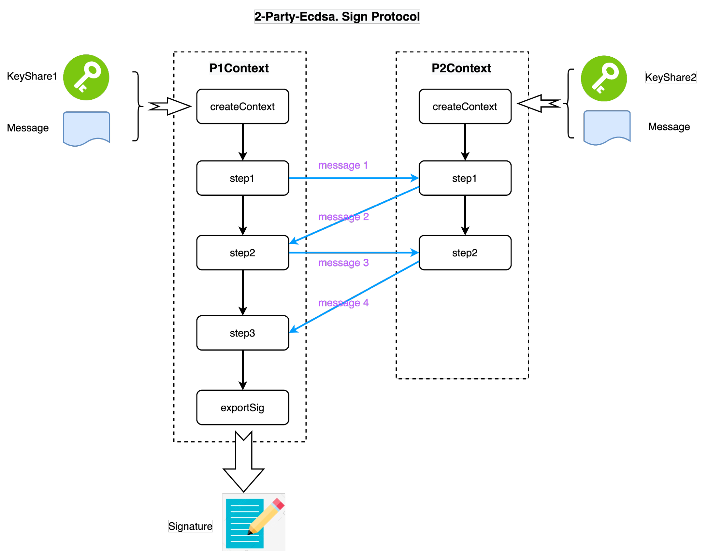
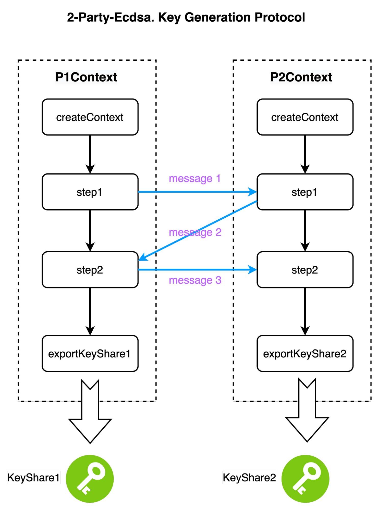

# Two-Party-Ecdsa-JS

Warning: <font color=red> This protocol does not implement zero-knowledge proofs and should not be used in a production environment. </font>

## Install
```shell
npm install --save @safeheron/two-party-ecdsa-js
```

## Usage

### Key Generation on Two-Party Ecdsa



```javascript
let p1Ctx = await TPCEcdsaKeyGen.P1Context.createContext()
let p2Ctx = await TPCEcdsaKeyGen.P2Context.createContext()
let message1 = p1Ctx.step1()
let message2 = p2Ctx.step1(message1)
let message3 = p1Ctx.step2(message2)
p2Ctx.step2(message3)

let keyShare1 = p1Ctx.exportKeyShare()
let keyShare2 = p2Ctx.exportKeyShare()
let keyShare1JsonStr = JSON.stringify(keyShare1.toJsonObject(), null, 4)
let keyShare2JsonStr = JSON.stringify(keyShare2.toJsonObject(), null, 4)
console.log("key share 1: \n", keyShare1JsonStr)
console.log("key share 2: \n", keyShare2JsonStr)
```
Run the case:
```shell
key share 1: 
 {
    "x1": "84069223caaffccecf9371c4adf9157ce704c001d35b7d60752b9d10de56eac3",
    "Q": {
        "curve": "secp256k1",
        "x": "54ceecd8a6606f0639b52e430dc4702a0302e309fcfe49e80de701ad8dfba578",
        "y": "ef74ed83cdb63231f71c5ea332aded870fbe331c3da139c3ec50afe269a3f1b3"
    },
    "pailPubKey": {
        "n": "7b71cd0338bbfe480ebb709382ed0cd67773a23ffb69875f7cf78cd4474a4c28c0c5dc6b21e031dbf485d299f575b9112597ad87bc92424db27e8d12b99b3b567f7b408a4e960f5890ea80a5394e3bc6380e929ff68d1a20581852c15f9acd7755e734332f21b122b7c0155bec6b98eef1cbdf39c7cc39d36fc75db273334bf329d41afc6351e5f9edb49cc01e179493d1d54b1bb16dfe8426f942f895dff4dba77c8886b8ca60383e6d4d6e77dfd4db6eed44603e05736788ed3ef2b57e8ac320e26441fd98f8fef209a017243b0d91f5806eb12a97dc180aa8cd01afc62bffb8714b3b415a1e510dc1ddaf77e9c4817aeb28f1472f0ba71957d5cce68782bb",
        "g": "7b71cd0338bbfe480ebb709382ed0cd67773a23ffb69875f7cf78cd4474a4c28c0c5dc6b21e031dbf485d299f575b9112597ad87bc92424db27e8d12b99b3b567f7b408a4e960f5890ea80a5394e3bc6380e929ff68d1a20581852c15f9acd7755e734332f21b122b7c0155bec6b98eef1cbdf39c7cc39d36fc75db273334bf329d41afc6351e5f9edb49cc01e179493d1d54b1bb16dfe8426f942f895dff4dba77c8886b8ca60383e6d4d6e77dfd4db6eed44603e05736788ed3ef2b57e8ac320e26441fd98f8fef209a017243b0d91f5806eb12a97dc180aa8cd01afc62bffb8714b3b415a1e510dc1ddaf77e9c4817aeb28f1472f0ba71957d5cce68782bc"
    },
    "pailPrivKey": {
        "lambda": "7b71cd0338bbfe480ebb709382ed0cd67773a23ffb69875f7cf78cd4474a4c28c0c5dc6b21e031dbf485d299f575b9112597ad87bc92424db27e8d12b99b3b567f7b408a4e960f5890ea80a5394e3bc6380e929ff68d1a20581852c15f9acd7755e734332f21b122b7c0155bec6b98eef1cbdf39c7cc39d36fc75db273334bf1c5fe6ac33242e30a434c34577d1b8a0ef74275eb07d3efc0866d2512481c9288e9f00419877ba8d2545beff5264a3d7c1516560974cab989a0d4c90917da29b0474ef6552a0c0b0d2ae6381db04edebe368c2e42177a1dacc0a284e342f174be95335ec545c0fea9dccea734e924475c262215b2b08d8524a2f31e162abe4548",
        "mu": "36be4673c5b0ef3a8fb370f235130a82fa2a5f2033961e698d074eb7abe8ff5c94c988e55984efb16c482b9ea149ad8ac4f10ac7dfce0bf3ea1a7acabd82a2036a56c8d2070babe31ffade5540154041e21c856b90f052bb0b74c6e6ddd390740e098262396ff565b9eaed0f7220ee0ba3c729144b3130a9aba44a1f8c25ffc3692d43fd9e154d9a2b61da70d4d2ae2d61013b65c9c982ee2a50582cf171ca968ba3be8de8a2d69c852e1dfae0414577a04570261c6096a4a69610edaf680da858cf599e0bdf8c9d8945a9d9d0791a0216b7f7e324bb5a2819199e9ab92aff85abb98d706fa6c42e8c8be5357c3f5be4343335fc6e6cd33a25a598f7ab80961c",
        "n": "7b71cd0338bbfe480ebb709382ed0cd67773a23ffb69875f7cf78cd4474a4c28c0c5dc6b21e031dbf485d299f575b9112597ad87bc92424db27e8d12b99b3b567f7b408a4e960f5890ea80a5394e3bc6380e929ff68d1a20581852c15f9acd7755e734332f21b122b7c0155bec6b98eef1cbdf39c7cc39d36fc75db273334bf329d41afc6351e5f9edb49cc01e179493d1d54b1bb16dfe8426f942f895dff4dba77c8886b8ca60383e6d4d6e77dfd4db6eed44603e05736788ed3ef2b57e8ac320e26441fd98f8fef209a017243b0d91f5806eb12a97dc180aa8cd01afc62bffb8714b3b415a1e510dc1ddaf77e9c4817aeb28f1472f0ba71957d5cce68782bb",
        "p": "b92eca149f3f5a9a768b32574ff3ae24c7d6b3f1fb0fd7111f51e3c6e1a6b8b3c32f543910f47cfca810c86a2abcf77ff51ca2598a10a5d67236949ee39e775ea2a9a310f90a4fb4ea30afa46e19ce05fc548eaf0b54fb5c06c1741386d4104b43fda9a5341c336f5f140520c81ef75d96bb1355cb9a288af68d85b218196b4d",
        "q": "aaa6e62491cfa85533dd361151085c6012bc213eae8a37b2813a3a1f6c1ca99efa5d3034205a3a694200950f26d89fdf64ba4bfd3f2a140775e1e14aba05e9b436e9cadbda829e3cdcf2b85505d260cdc29fb1c007c8c30f4344d40ae600a6f5df4042d0c77cec37d1df3159c6a685c7be0dffe8cb075df77fd73204a3afd227",
        "pSqr": "85f4a89f0d1758b10ec976381178ceacbcfe01f795bb3cae73e418e2b18b6b86c6aef70b5f5bd05c1ab21300c87dcac9030142ba65b11a79eda292174811918eede7ea791c31a1191dc612131733a5daa18366c99ae94ba42ddbf1d5688ffdbfdf663e7e3017c6748504ad1cd00bc71d749b4a3fcf966483b6a01e6d7800f6fa0bb3ae7fbc990ba024e9b48d824d94c6cfbe8a44ebb2342eaacb1243c84e1a3b1b5475a36b13b38a23a631fbc357fbe8ac216a6f1ddd42b81e8ea6c51bbb8e71bb139ef4fae6338b92bbee09530b0e32d2ba75fdc0692b5b34ac626dea54a5a5a66b903bd967385a910d7233f8738f73099a149bf5e5ae2c1dedffb892037529",
        "qSqr": "71c21677d7faa019ef4e64fb5eaceb6c15fbcd87fabd4f5e0cceebe69d1400d0a80d59ea5ee7d416d6b021243efb9b9e857e2aa69a76f86cd4b47bf0a7b35b7852b8c0580e8929f54b285c707a4d53a59ac33046613f28879f66bd1fb0929c101bec8a010dd1c2584960f4cc53fe46b2e6069f8c51af5ab8146afd893afb44bd87a30d4b8f91951f9310a9b675d0c579d2a88c6ea65083dc08e83c40e8c05abc7c10dd0be9178fcf3d417afee4bc15419cfaaca6639976c8cea45c79ccc4c3c9a01f23439c07d136e76a9776d0c7625219d24ea987737cf40cc69d6608b3d81a68fcfa3e4394188f8ade5e1f3830ca3292977ffe9c13111de3c12b96a7d601f1",
        "pMinus1": "b92eca149f3f5a9a768b32574ff3ae24c7d6b3f1fb0fd7111f51e3c6e1a6b8b3c32f543910f47cfca810c86a2abcf77ff51ca2598a10a5d67236949ee39e775ea2a9a310f90a4fb4ea30afa46e19ce05fc548eaf0b54fb5c06c1741386d4104b43fda9a5341c336f5f140520c81ef75d96bb1355cb9a288af68d85b218196b4c",
        "qMinus1": "aaa6e62491cfa85533dd361151085c6012bc213eae8a37b2813a3a1f6c1ca99efa5d3034205a3a694200950f26d89fdf64ba4bfd3f2a140775e1e14aba05e9b436e9cadbda829e3cdcf2b85505d260cdc29fb1c007c8c30f4344d40ae600a6f5df4042d0c77cec37d1df3159c6a685c7be0dffe8cb075df77fd73204a3afd226",
        "hp": "94f7d49d4a27fd50b4a9f4195b730f30efa453d42147461f627b3b74b32ff027ab00eb5a69b84e5cb62a898e8115fd65ff8638b0a5625ada907f3bfe19aefbb29619bfb64b0e998cb36205c49914c49084dcdac4666bc04ea754dbee04b64fd04bfe15e6283ba65ebfcad5147ea57844f8deaed1b77e2b18aa3802cb3d6d9e79",
        "hq": "215f7d813664c633bec76ceb43172071025c6ae0bd39e777f29c959d264b22b011271e400f58201c70a3abcff4751e6476235c864bd94e56dbb31564f0aaddcacd48473556372472e3ffe637b21768bc6236393218b4c7022a73501a860dbbff57ff05e674767a49c7aec2c0d0f38dd6455bd6fde2d111b61a385db44b6969f7",
        "qInvP": "2436f57755175d49c1e13e3df4809ef3d832601dd9c890f1bcd6a8522e76c88c182e68dea73c2e9ff1e63edba9a6fa19f59669a8e4ae4afbe1b758a0c9ef7bac0c8fe35aadfbb62836cea9dfd50509757777b3eaa4e93b0d5f6c9825821dc07af7ff93bf0be08d109f49300c49797f189ddc6484141bfd724c5582e6daabccd4",
        "pInvQ": "894768a35b6ae2217515c9260df13bef105fb65df150503a8e9da48245d186eee93611f411021a4cd15ce93f3263817aee96ef76f350c5b09a2ecbe5c95b0be969a183a6844b79c9f8f2d21d53baf8116069788def13fc0d18d183f05ff2eaf687413cea530671ee0a306e98f5b2f7f178b228eae8364c41659ed45058466830"
    }
}
key share 2: 
 {
    "x2": "b7e006f25a6f9abeae16d9029d3eb58ca462b6ec838478b8773708438c46907a",
    "Q": {
        "curve": "secp256k1",
        "x": "54ceecd8a6606f0639b52e430dc4702a0302e309fcfe49e80de701ad8dfba578",
        "y": "ef74ed83cdb63231f71c5ea332aded870fbe331c3da139c3ec50afe269a3f1b3"
    },
    "pailPubKey": {
        "n": "7b71cd0338bbfe480ebb709382ed0cd67773a23ffb69875f7cf78cd4474a4c28c0c5dc6b21e031dbf485d299f575b9112597ad87bc92424db27e8d12b99b3b567f7b408a4e960f5890ea80a5394e3bc6380e929ff68d1a20581852c15f9acd7755e734332f21b122b7c0155bec6b98eef1cbdf39c7cc39d36fc75db273334bf329d41afc6351e5f9edb49cc01e179493d1d54b1bb16dfe8426f942f895dff4dba77c8886b8ca60383e6d4d6e77dfd4db6eed44603e05736788ed3ef2b57e8ac320e26441fd98f8fef209a017243b0d91f5806eb12a97dc180aa8cd01afc62bffb8714b3b415a1e510dc1ddaf77e9c4817aeb28f1472f0ba71957d5cce68782bb",
        "g": "7b71cd0338bbfe480ebb709382ed0cd67773a23ffb69875f7cf78cd4474a4c28c0c5dc6b21e031dbf485d299f575b9112597ad87bc92424db27e8d12b99b3b567f7b408a4e960f5890ea80a5394e3bc6380e929ff68d1a20581852c15f9acd7755e734332f21b122b7c0155bec6b98eef1cbdf39c7cc39d36fc75db273334bf329d41afc6351e5f9edb49cc01e179493d1d54b1bb16dfe8426f942f895dff4dba77c8886b8ca60383e6d4d6e77dfd4db6eed44603e05736788ed3ef2b57e8ac320e26441fd98f8fef209a017243b0d91f5806eb12a97dc180aa8cd01afc62bffb8714b3b415a1e510dc1ddaf77e9c4817aeb28f1472f0ba71957d5cce68782bc"
    },
    "cypher_x1": "18c0b94e8cd084595606b7054ebde4b986267dd58558928ade487a0371bdd1865a32bb416fc7e192a82db08443091e0dd87eeadcfa94a46691d8f8f4613f7bf6ef20a4986253bc0a759222a7bbd5d50c746093b933524afe4fd4b3b27114ba763282054134ae785d1660249f65618f90877d7b650e94a42b6fe81063e918121b6f60da5491d27dee0146af2fceae8a12b50e9c4f3984e6a78bb497474855d363e0115690733d8ad2ff68b9e6a04a5706b7f89e45c2cc2c33e47a268951ad577a466f4b993aaf51e35c1d7cc0d44047e27ee32c5d15258f7f37a06754c62041fdc2f633e09ef0f17cf6ec30c6ced95990cd664a15e4e49f83b156c53c37dc6e9f8a2b4c5c0a016e3f32b6ca0a4ed5ad7ee83ec3f4bf88abaacf452bf201368606404bb51f75cb0994f5c6250a9004ee488fbbdb777b640d1e6720f4ab782565fd5ea72d5337ec284e40941811fa13c98f20772038964aee604e41261db903ab65c9cc3723c88ea8c2bf2c787a97d90011099cf11f248c749923bf714ac95093c72c799ac2809cc98d260b331e7d34c86e5fe5e9b3d1df9ff3b1996beca64c0531935288f6f4682bba13e1f86563f07a30a5766c162de32c99bf25ed3a7ae4a18809f07fa04b97523c8fec373702ce83f2730a79e1ad317ec5bcea86d0f2d59298489e748f770ec6f61200988ba4190477bf0ee64e88d7962e5169a9e05261e3c0"
}
```

### Signature on Two-Party Ecdsa



```javascript

let keyShare1Json = '' +
    '{\n' +
    '    "x1": "8493ca197311af71fc9ad1643417424d7cefd4f7796e2ae7ecbd66480f0939b4",\n' +
    '    "Q": {\n' +
    '        "curve": "secp256k1",\n' +
    '        "x": "a1be7ebf6b7cfe3c82df02937fdd45e75a876397325e4f86d8e77850b453d74",\n' +
    '        "y": "3041ec5158bba7155f4fa773a2a341f102cf0f65d97b78040e0f9e8328ee67f6"\n' +
    '    },\n' +
    '    "pailPubKey": {\n' +
    '        "n": "64515dcb56d8f1fbf3ea90d464ac0764e2e7229067f8936a1384b48c6335a3acf268a85015ce37d31e3aa18f2beff972d24fcbc0b959ce040d4db69e432675cfc1c5d5a2b73655c5c01923e7f7bf73aced5f3ef6df5afd04db9df25dc8a3e1a01b9c2ae3f8c26e084504a3e8a44c3ec6631d92d93124f45353b433a682f762923364acc85dd38f28e706059908c29c9743802a0db9b94f84890cdc64c41b7a31f22ae11cf5e7037f6e79b00594813259fa340995886caf189fee292f43dc7dc4c3cefb0875bb36d8f2c2630f2fe64c9bfa48d153489abecd663407fea94147650829a83cebd310da7ba0fc184913f0cedba2bd509e193a624da92d52cf33d10b",\n' +
    '        "g": "64515dcb56d8f1fbf3ea90d464ac0764e2e7229067f8936a1384b48c6335a3acf268a85015ce37d31e3aa18f2beff972d24fcbc0b959ce040d4db69e432675cfc1c5d5a2b73655c5c01923e7f7bf73aced5f3ef6df5afd04db9df25dc8a3e1a01b9c2ae3f8c26e084504a3e8a44c3ec6631d92d93124f45353b433a682f762923364acc85dd38f28e706059908c29c9743802a0db9b94f84890cdc64c41b7a31f22ae11cf5e7037f6e79b00594813259fa340995886caf189fee292f43dc7dc4c3cefb0875bb36d8f2c2630f2fe64c9bfa48d153489abecd663407fea94147650829a83cebd310da7ba0fc184913f0cedba2bd509e193a624da92d52cf33d10c"\n' +
    '    },\n' +
    '    "pailPrivKey": {\n' +
    '        "lambda": "64515dcb56d8f1fbf3ea90d464ac0764e2e7229067f8936a1384b48c6335a3acf268a85015ce37d31e3aa18f2beff972d24fcbc0b959ce040d4db69e432675cfc1c5d5a2b73655c5c01923e7f7bf73aced5f3ef6df5afd04db9df25dc8a3e1a01b9c2ae3f8c26e084504a3e8a44c3ec6631d92d93124f45353b433a682f76290f20506918e770157545f6183cb997a0b4e7163b5e4b1f602f789e6c04a838e5fdf583f350ec6b633b5ca217bf1947564e34a49d2479ff39c8a07eb631ac6c101337b9481d619457fcf82954f8563482efc90c731e54f9e9a8f1e7abab2c1095cdcc9cc56600800d9beef91ebbc000e29c4d8b54af85ac4b88923cd8f6cc58478",\n' +
    '        "mu": "2b9fd5bc0afc95771d7dcbc58bdcf3d1f3692ec7e8eed249795d260e0b4d062d7ae3e3df8e001c618f24386b66acdc4ec9f2ebff63e616c10f966e91b10e318a53dce020adff6b953ef78c6ad1da8ae96dc2ccf61d32c8d5f7234b4d971dbe3a91b5e28fc13c55a02b61eae6eee8cab59b0f1368bc39f23fb5d29932e5631b732dc5a80d060746fff2af9592c70bc5b58408448d623cf8928f9bd0827bd6f14343b164345f12bd63b6f502de139c144ba4816f45288d7fb3314398ab9b65398221d7c9828351eaf1ee2a80822b18c2515381900bcec1d3c4ee50e8b759f650320a2626820790a0d8928285a59f926b349da04eeb98554706a6350af7952f69e9",\n' +
    '        "n": "64515dcb56d8f1fbf3ea90d464ac0764e2e7229067f8936a1384b48c6335a3acf268a85015ce37d31e3aa18f2beff972d24fcbc0b959ce040d4db69e432675cfc1c5d5a2b73655c5c01923e7f7bf73aced5f3ef6df5afd04db9df25dc8a3e1a01b9c2ae3f8c26e084504a3e8a44c3ec6631d92d93124f45353b433a682f762923364acc85dd38f28e706059908c29c9743802a0db9b94f84890cdc64c41b7a31f22ae11cf5e7037f6e79b00594813259fa340995886caf189fee292f43dc7dc4c3cefb0875bb36d8f2c2630f2fe64c9bfa48d153489abecd663407fea94147650829a83cebd310da7ba0fc184913f0cedba2bd509e193a624da92d52cf33d10b",\n' +
    '        "p": "ac78c89837c0c4230dc0e76f4c1f43e142129d682f54e1a4d06dddf140f0d0527891074c96d73684e1390b12257bdfdeab60df1b708a6a575c1d780606ec1d012677a20724975911230ea56b3a3a683208e6e9fab7f2859814725c63be067f9c389da1281c5a9761e398468b386f00f35cb4507f0a419fcbf54c2f01ed69b0a5",\n' +
    '        "q": "94e6dd9e979bc9ae84e5bca5f109deaab2fc28efa5b277dcc11517b338a71b7f9a419a9b504916c6d77683777d70dd166b88e0a7d0425124b9c8c5c622299fc269dbc47f7b0a98480031285470489c3af4d12026ab589a9ac2a330e03879be6bf2c23abe6f70789ed91923a154a4e1b1ba15b7869b7cd5ddcf3930c175049bef",\n' +
    '        "pSqr": "7432868936cd7de66edc30622015524ab2ae039fb00024578389847a7947cacfaf30c19cc597143beea81824bc60f42b159b2c4795fa8181e7f7247c765bc72d63659c6ebe1537095309142ae131b3b72a074f9d64767061c8706772b34a08235dd57bb13f72601fd7a6b193e0060313ff90e304ac8320b9ded376b58568b0832034356e430209244e85bf5c104a421b7e511ec3251ebe3378ba9ab719a22cc7b725df6f2c35212010faebcc33da6544dcc4bfde74c1e1d92fa8420ebdc08fa87ca0e2785c6725bfb921883f33ba70b2435dcf32901d985c64b648d704c406d6387cac600e5ca02aca0057ad0a8886b037150fcc090813bb39d4d3fde33d4a59",\n' +
    '        "qSqr": "569bc072581fc122a78dda89452b5c99ef2105974b88e4cc58952c89e3e31622912beb66f678b36a3552569abadfe22e435e1281cb576a15ad104f140ceb1e39ff7ae48328dceda46a30874f8ae1cec432f811fbc279df4de981822ff807ab9be42fa8ced0c7e03e0008f3ba3b89cf84c1eb850d451faa5df9987cb781563e135a7a7df592dc4ea5ee819e14d659f9007b9683b240bba490affe1b799248d506f03ba1643e3affeac3f93ae341891de64dab3845d7e9aa2291654b31280732219427c21c61deaef52302b60e9bc77e6795bd70dd8f097e08721286fadd4049b1d551e2497ec6be2f9cf6709ed8881f2013b385dbc9a59ef35357f4fbb4734921",\n' +
    '        "pMinus1": "ac78c89837c0c4230dc0e76f4c1f43e142129d682f54e1a4d06dddf140f0d0527891074c96d73684e1390b12257bdfdeab60df1b708a6a575c1d780606ec1d012677a20724975911230ea56b3a3a683208e6e9fab7f2859814725c63be067f9c389da1281c5a9761e398468b386f00f35cb4507f0a419fcbf54c2f01ed69b0a4",\n' +
    '        "qMinus1": "94e6dd9e979bc9ae84e5bca5f109deaab2fc28efa5b277dcc11517b338a71b7f9a419a9b504916c6d77683777d70dd166b88e0a7d0425124b9c8c5c622299fc269dbc47f7b0a98480031285470489c3af4d12026ab589a9ac2a330e03879be6bf2c23abe6f70789ed91923a154a4e1b1ba15b7869b7cd5ddcf3930c175049bee",\n' +
    '        "hp": "5dc3beeab592b40d6a33871515e7c58b665d7fdfe745899d9ec3d7903a046c59d87270e48f195615d91d0572f5611ef45e985c69c18decb740ead652cecff8460d68309af547ac7ce195a4629dbbcec15f922642c6b2a26b5db6ad534c01e7c28ad06b03b4318c0690151d80f50f29b19e3d9fd73a96c0d0b077103ea61355b1",\n' +
    '        "hq": "43f3789338f8ea229d7bd69d18f38e110370a500ce9cc110b31bd09edf5bb47938b65feaf5937b055fc47d50f257207eb4f4a2f196d4b78e5b20618eb88779c0265bf3e4ef525a1975084c1811548e1d5f3c6cf49be619c23fcd14124896b99271afe1d510e549e704b6a6c1e9c456c3636b645172130a3882dfbbbfd01b41af",\n' +
    '        "qInvP": "4eb509ad822e1015a38d605a36377e55dbb51d88480f580731aa066106ec63f8a01e966807bde06f081c059f301ac0ea4cc882b1aefc7da01b32a1b3381c24bb190f716c2f4fac94417901089c7e9970a954c3b7f13fe32cb6bbaf10720497d9adcd362468290b5b5383290a435fd741be76b0a7cfaadefb44d51ec347565af4",\n' +
    '        "pInvQ": "50f3650b5ea2df8be769e608d8165099af8b83eed715b6cc0df94714594b6706618b3ab05ab59bc177b206268b19bc97b6943db6396d99965ea8643769a22602437fd09a8bb83e2e8b28dc3c5ef40e1d9594b3320f7280d882d61ccdefe304d9811258e95e8b2eb7d4627cdf6ae08aee56aa53352969cba54c597501a4e95a40"\n' +
    '    }\n' +
    '}'


let keyShare2Json = '' +
    '{\n' +
    '    "x2": "32468c05e7441d165450805c9030a5bc1fb00e7f392780bacd2875e717cf9343",\n' +
    '    "Q": {\n' +
    '        "curve": "secp256k1",\n' +
    '        "x": "a1be7ebf6b7cfe3c82df02937fdd45e75a876397325e4f86d8e77850b453d74",\n' +
    '        "y": "3041ec5158bba7155f4fa773a2a341f102cf0f65d97b78040e0f9e8328ee67f6"\n' +
    '    },\n' +
    '    "pailPubKey": {\n' +
    '        "n": "64515dcb56d8f1fbf3ea90d464ac0764e2e7229067f8936a1384b48c6335a3acf268a85015ce37d31e3aa18f2beff972d24fcbc0b959ce040d4db69e432675cfc1c5d5a2b73655c5c01923e7f7bf73aced5f3ef6df5afd04db9df25dc8a3e1a01b9c2ae3f8c26e084504a3e8a44c3ec6631d92d93124f45353b433a682f762923364acc85dd38f28e706059908c29c9743802a0db9b94f84890cdc64c41b7a31f22ae11cf5e7037f6e79b00594813259fa340995886caf189fee292f43dc7dc4c3cefb0875bb36d8f2c2630f2fe64c9bfa48d153489abecd663407fea94147650829a83cebd310da7ba0fc184913f0cedba2bd509e193a624da92d52cf33d10b",\n' +
    '        "g": "64515dcb56d8f1fbf3ea90d464ac0764e2e7229067f8936a1384b48c6335a3acf268a85015ce37d31e3aa18f2beff972d24fcbc0b959ce040d4db69e432675cfc1c5d5a2b73655c5c01923e7f7bf73aced5f3ef6df5afd04db9df25dc8a3e1a01b9c2ae3f8c26e084504a3e8a44c3ec6631d92d93124f45353b433a682f762923364acc85dd38f28e706059908c29c9743802a0db9b94f84890cdc64c41b7a31f22ae11cf5e7037f6e79b00594813259fa340995886caf189fee292f43dc7dc4c3cefb0875bb36d8f2c2630f2fe64c9bfa48d153489abecd663407fea94147650829a83cebd310da7ba0fc184913f0cedba2bd509e193a624da92d52cf33d10c"\n' +
    '    },\n' +
    '    "cypher_x1": "9f7a0899a087ae44553ce7159d61017a1e4d7debfc5285b768017f504a4a19813f01536df20ec2f080f893cae996d4894d432e3450b4dde2c59bee5bbff25f9d57a3ac32dcbf3a897108feab15c13daff05b5ce9192f76cfc677a04f1887ff59cddc0937f9aca4be958b22076a1c9d55ea34aaacbf820ee2ec2aba129e62150d55bb590152e83e7227f3c1e0227aabf74c53ea37c56794b1aca7c3261a6031d582c9bd7c6fb13a36fbff689a9fa94ee8ec51898bde8d67e1bc70e79101b8bdeecd37dd8cc9a4f0db19a5066804d6c4d33118f67f2ccb18128e513af284a2710f9028d3e5f5b914ec3b7b7f8339e0acce6b76c62cf82061f53968b028e17793e99ecf4555b60ba19ce0df2f59857e675a5190b94519acf501883f49be79f5ca628db54a66288dda3b7d3a8c2675e11d70d0d5e50f9d6e9c44aacac5883e4cb63671f5ffa29de605ed1a62fb00ce738b15cbe4faaff45dd4e79937e2b8acc1ffa758286018674cc8f4b71989f46eb6edbea0e530f212d770e2dda9c384ae6945b9d6e4c5c1d081d3f350f6dcf17357325780368798b4383c46efcebf20ab88e0b8fbc9cd9cd21211fac243335a9d42c33d5a94b88766073bc07cc07e5694f0a26e21daab5be90b0e8a6ed16f3227b348ed1b7e4ead25ac24adf7f8570d758941d40b65b28b88a30d4116e5e14309f6b02617373afd2ed9eff6f9dc1c8b4f141ae"\n' +
    '}'


let m = new BN("1234567812345678123456781234567812345678123456781234567812345678")
let p1Ctx = await TPCEcdsaSign.P1Context.createContext(keyShare1Json, m)
let p2Ctx = await TPCEcdsaSign.P2Context.createContext(keyShare2Json, m)

let message1 = p1Ctx.step1()
let message2 = p2Ctx.step1(message1)
let message3 = p1Ctx.step2(message2)
let message4 = p2Ctx.step2(message3)
p1Ctx.step3(message4)

let [r, s, v] = p1Ctx.exportSig()
console.log("r: \n", r.toString(16))
console.log("s: \n", s.toString(16))
console.log("v: \n", v)

assert(verifySig(m, r, s, v, p1Ctx.keyShare1.Q))
```

Run the case:
```shell
r: 
 4bc96a457b9d3fd89c3213e886bcb755ec373d2f70533a130ea45f5d4fecad98
s: 
 14a4d825ccb98a18a840fd4ddd169b20902f20aaf4066fd17fa81d003d35a118
v: 
 1
```

